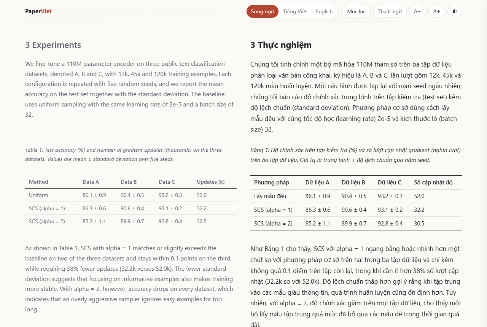
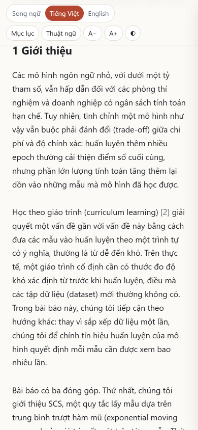

<div align="center">

# 📖 PaperViet

**Đọc bài báo khoa học tiếng Anh bằng tiếng Việt tự nhiên, ngay trong agent AI bạn đang dùng.**

**Song ngữ đối chiếu · Thuật ngữ thống nhất · Giữ nguyên công thức và số liệu · Không cần API key**

Tiếng Việt · [English](README.en.md)



<sub>Bài báo trong ảnh là bài báo hư cấu viết riêng cho bản demo (xem <a href="examples/">examples/</a>).</sub>

</div>

---

PaperViet là một **agent skill** theo chuẩn mở [Agent Skills](https://agentskills.io) (`SKILL.md`),
dùng được với Claude Code, Codex CLI, Gemini CLI, Cursor, GitHub Copilot và các agent hỗ trợ chuẩn này.
Bạn đưa vào một tệp PDF; agent tách bài báo thành từng phần, dịch sang văn phong khoa học tiếng Việt
với bảng thuật ngữ nhất quán, tự kiểm tra lỗi rồi xuất ra một trang HTML song ngữ đọc được cả trên điện thoại.

Ý tưởng lấy cảm hứng từ [easyread](https://github.com/Edwardxlai/easyread) (đọc bài báo tiếng Anh bằng
tiếng Trung), nhưng PaperViet được làm riêng cho người Việt: hướng dẫn văn phong tiếng Việt, bảng thuật
ngữ Anh – Việt và công cụ bắt lỗi "văn dịch máy".

## ✨ Vì sao PaperViet

| | |
|---|---|
| 🇻🇳 **Tiếng Việt học thuật, không phải văn dịch máy** | Có sẵn hướng dẫn văn phong: tránh "một cách", "được ... bởi", lạm dụng "việc/sự"; dịch đúng mức độ chắc chắn (suggest ≠ prove); "we propose" → "chúng tôi đề xuất". |
| 📚 **Thuật ngữ thống nhất** | Bảng thuật ngữ Anh – Việt có sẵn hơn 500 mục (AI/học máy, khoa học máy tính, toán, thống kê, sinh học, y học, kinh tế). Mỗi bài có một `glossary.csv` riêng; lần đầu ghi "học tăng cường (reinforcement learning)", các lần sau chỉ tiếng Việt. |
| 🔢 **Không làm sai số liệu** | Công thức, biến, mã, trích dẫn `[12]`, tên riêng và tài liệu tham khảo được giữ nguyên. Công cụ kiểm tra báo ngay khi một con số hay trích dẫn bị mất. |
| 📄 **Bài dài cũng không sao** | Bài được chia thành từng phần và lưu tiến độ ra tệp; ngắt giữa chừng thì lần sau agent dịch tiếp đúng chỗ. |
| 🔑 **Không cần API key, không cài app** | Chính agent bạn đang dùng làm việc dịch. Script phụ trợ chỉ cần Python và một thư viện đọc PDF. |
| 🆓 **Miễn phí, mã nguồn mở** | Giấy phép MIT. |

## 🚀 Tính năng

**Bốn chế độ**
- **Dịch toàn bài**: dịch song ngữ từng đoạn, xuất HTML + Markdown.
- **Đọc nhanh**: tóm tắt tiếng Việt gồm vấn đề, đóng góp chính, phương pháp, kết quả (giữ nguyên số), hạn chế và câu hỏi nên đặt ra.
- **Giải thích đoạn khó**: dịch sát, giải thích dễ hiểu, ý nghĩa từng ký hiệu trong công thức, ví dụ số nhỏ.
- **Chỉ lấy thuật ngữ**: bảng thuật ngữ Anh – Việt của riêng bài báo.

**Trang đọc song ngữ (một tệp HTML, chạy offline)**
- Hai cột Anh | Việt; chế độ chỉ tiếng Việt (chạm vào đoạn để xem câu gốc) hoặc chỉ tiếng Anh.
- Mục lục, bảng thuật ngữ có ô lọc, giao diện sáng/tối, chỉnh cỡ chữ, in ra giấy gọn gàng.
- Đọc tốt trên điện thoại; bảng số liệu hiển thị thành bảng; không tải gì từ Internet.

**Trích xuất PDF**
- Nhận diện tiêu đề, tác giả, tóm tắt, đề mục, chú thích hình/bảng, công thức, bảng, chú thích chân trang, tài liệu tham khảo.
- Xử lý bố cục hai cột, nối đoạn bị ngắt qua trang, bỏ header/footer và số trang, nối từ bị gạch nối cuối dòng.

**Kiểm tra bản dịch** (`glossary.py check`)
- Thuật ngữ dịch khác `glossary.csv`, một thuật ngữ dịch nhiều kiểu khác nhau.
- Số liệu, trích dẫn, công thức inline, mã, URL bị mất hoặc bị sửa.
- Gợi ý văn phong: "một cách", "được ... bởi", câu mở đầu bằng "Nó", "chúng ta" thay cho "chúng tôi", đoạn còn sót tiếng Anh.

<p align="center"></p>

## 📥 Cài đặt

### Claude Code (khuyên dùng: cài dạng plugin)

Trong Claude Code:
```
/plugin marketplace add mahiepit/PaperViet
/plugin install paper-viet@paperviet
```
Hoặc từ terminal:
```bash
claude plugin marketplace add mahiepit/PaperViet
claude plugin install paper-viet@paperviet
```

### Các agent khác (sao chép thư mục skill)

Tải mã nguồn rồi chép thư mục `skills/paper-viet` vào thư mục skill của agent:

| Agent | Thư mục cá nhân (mọi dự án) | Thư mục trong dự án |
|---|---|---|
| Claude Code | `~/.claude/skills/` | `.claude/skills/` |
| Codex CLI | `~/.agents/skills/` | `.agents/skills/` |
| Gemini CLI | `~/.gemini/skills/` hoặc `~/.agents/skills/` | `.gemini/skills/` hoặc `.agents/skills/` |
| Cursor | `~/.cursor/skills/` hoặc `~/.agents/skills/` | `.cursor/skills/` hoặc `.agents/skills/` |
| GitHub Copilot | `~/.copilot/skills/` hoặc `~/.agents/skills/` | `.github/skills/` hoặc `.agents/skills/` |

`~/.agents/skills/` dùng chung được cho Codex, Gemini CLI, Cursor và Copilot.

macOS / Linux:
```bash
git clone https://github.com/mahiepit/PaperViet.git
mkdir -p ~/.agents/skills && cp -r PaperViet/skills/paper-viet ~/.agents/skills/
```

Windows (PowerShell):
```powershell
git clone https://github.com/mahiepit/PaperViet.git
New-Item -ItemType Directory -Force "$HOME\.agents\skills" | Out-Null
Copy-Item -Recurse PaperViet\skills\paper-viet "$HOME\.agents\skills\"
```

### Thư viện đọc PDF (một lần)

Script cần **Python 3.9+** và một trong hai thư viện:
```bash
pip install pymupdf      # khuyên dùng: nhận diện cấu trúc tốt hơn (cỡ chữ, chữ đậm, hai cột)
pip install pypdf        # nhẹ hơn, thuần Python
```
Chưa cài được? Agent vẫn làm được: Claude Code đọc PDF trực tiếp, chép văn bản ra tệp `.txt`
rồi tiếp tục quy trình như bình thường.

## 💬 Cách dùng

Chỉ cần nói với agent bằng tiếng Việt, ví dụ:

```text
Dịch bài báo paper.pdf sang tiếng Việt
Đọc nhanh giúp mình bài attention.pdf: đóng góp chính, phương pháp, kết quả, hạn chế
Giải thích phương trình (3) ở mục 2.2 trong paper.pdf
Lập bảng thuật ngữ Anh – Việt cho bài báo này
Chỉ dịch trang 1 đến 6 của paper.pdf
Tiếp tục dịch paper.pdf
```

Trong Claude Code bạn cũng có thể gọi trực tiếp: `/paper-viet:paper-viet paper.pdf` (khi cài dạng plugin)
hoặc `/paper-viet paper.pdf` (khi chép vào `~/.claude/skills`).

Kết quả nằm cạnh tệp PDF, trong thư mục `paper.paperviet/`:

```
paper.paperviet/
├── paper.vi.html          ← mở bằng trình duyệt để đọc song ngữ
├── paper.vi.md            ← bản Markdown (tiếng Việt, hoặc song ngữ với --md-mode bilingual)
├── doc-nhanh.vi.md        ← bản "đọc nhanh" (nếu có)
├── glossary.csv           ← thuật ngữ đã chọn cho bài này
├── chunks/  translations/ ← từng phần bản gốc / bản dịch (= tiến độ, để dịch tiếp)
└── document.json  source.md  pages/
```

Xem ví dụ hoàn chỉnh trong [examples/](examples/): bài báo mẫu [sample-paper.pdf](examples/sample-paper.pdf),
bản dịch [sample-paper.vi.md](examples/sample-paper.vi.md) và trang song ngữ `examples/sample-paper.vi.html`
(tải về rồi mở bằng trình duyệt).

## ⚙️ Cách hoạt động

```
paper.pdf
   │  extract_pdf.py      tách khối: tiêu đề, tóm tắt, đề mục, đoạn, công thức, bảng, tài liệu tham khảo
   ▼
paper.paperviet/chunks/chunk-01.en.md …     (mỗi phần ~1200 từ, có đánh dấu khối <!-- b12 -->)
   │  glossary.py lookup  chọn thuật ngữ cho bài → glossary.csv
   │  agent dịch          từng phần → translations/chunk-01.vi.md …  (theo hướng dẫn văn phong)
   │  glossary.py check   bắt lỗi thuật ngữ, số liệu, trích dẫn, văn phong
   ▼
render.py  →  paper.vi.html (song ngữ, offline)  +  paper.vi.md
```

Agent tự chạy các lệnh này. Nếu muốn dùng tay:

```bash
S=~/.agents/skills/paper-viet/scripts
python $S/extract_pdf.py paper.pdf                 # tạo paper.paperviet/
python $S/glossary.py lookup paper.paperviet --write
python $S/render.py paper.paperviet --status       # tiến độ, phần cần dịch tiếp
python $S/glossary.py check paper.paperviet        # kiểm tra bản dịch
python $S/render.py paper.paperviet                # xuất HTML + Markdown
python $S/glossary.py show "learning rate"         # tra thuật ngữ
```

## 📚 Bảng thuật ngữ của riêng bạn

Tạo tệp `~/.paperviet/glossary.csv` (UTF-8) theo dạng:

```csv
en,vi,domain,note
learning rate,tốc độ học,ml,
attention head,đầu chú ý,ml,
transformer,Transformer,ml,giữ nguyên tên kiến trúc
```

Tệp này được nạp tự động và ghi đè bảng có sẵn. Có thể thêm tệp khác qua biến môi trường
`PAPERVIET_GLOSSARY` hoặc tham số `--glossary`. Nhiều cách dịch cho một từ thì ngăn bằng `|`
(cách đầu tiên được ưu tiên). Thuật ngữ đã chốt cho từng bài nằm ở `paper.paperviet/glossary.csv`.

Bảng có sẵn nằm ở [skills/paper-viet/references/glossary.csv](skills/paper-viet/references/glossary.csv).
Rất mong nhận đóng góp thêm thuật ngữ chuẩn cho các ngành khác qua pull request.

## ❓ Lưu ý và giới hạn

- Chất lượng bản dịch phụ thuộc vào mô hình AI bạn dùng. Hãy đối chiếu bản gốc khi trích dẫn hoặc dùng số liệu.
- PDF dạng ảnh scan cần OCR trước (ví dụ `ocrmypdf`).
- Công thức được giữ nguyên dạng văn bản trích từ PDF; công thức phức tạp có thể bị lệch ký tự, khi đó hãy xem bản PDF gốc.
- Hình ảnh không được trích ra; chú thích hình vẫn được dịch.
- Với `pypdf`, ranh giới đoạn văn đôi khi bị gộp; `pymupdf` cho kết quả tốt hơn.

## 🧪 Phát triển

```bash
pip install pymupdf pypdf pytest
python -m pytest
python tools/make_sample_pdf.py      # tạo lại examples/sample-paper.pdf
```

## ❤️ Ủng hộ dự án

PaperViet miễn phí và sẽ luôn miễn phí. Nếu nó giúp bạn tiết kiệm thời gian, một khoản ủng hộ nhỏ giúp dự án được duy trì. Cảm ơn bạn!

<table>
<tr>
<td align="center"><b>PayPal</b><br><br><a href="https://paypal.me/thaogia">paypal.me/thaogia</a></td>
<td align="center"><b>BNB (BEP-20) / ETH (ERC-20)</b><br><br><code>0xd09c2E60cbC8526976C436e316630FA64296E824</code></td>
</tr>
</table>

Hãy kiểm tra đúng mạng (BNB Smart Chain hoặc Ethereum) trước khi gửi tiền mã hoá.

## 📄 Giấy phép

[MIT](LICENSE) © Thảo Gia. Bài báo mẫu trong `examples/` là văn bản hư cấu do dự án tự viết, phát hành cùng giấy phép MIT.
PaperViet là dự án độc lập, không liên quan tới easyread hay các nhà phát triển agent được nhắc tới.
